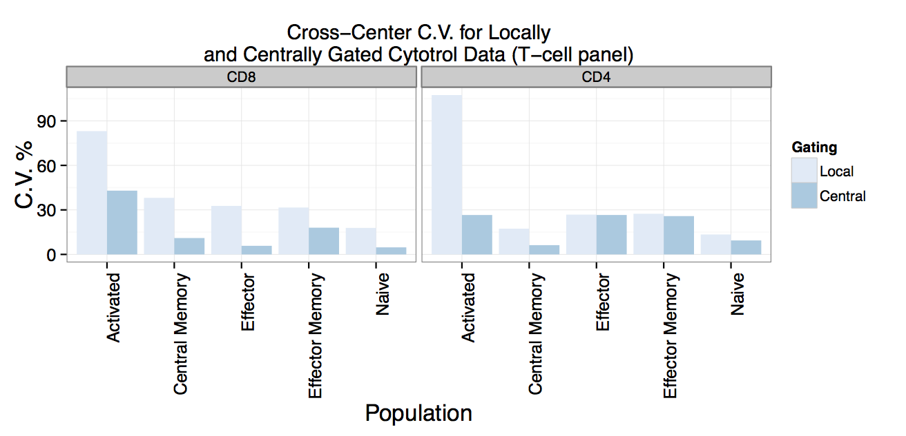
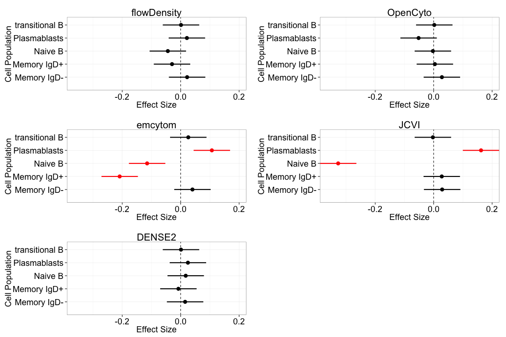
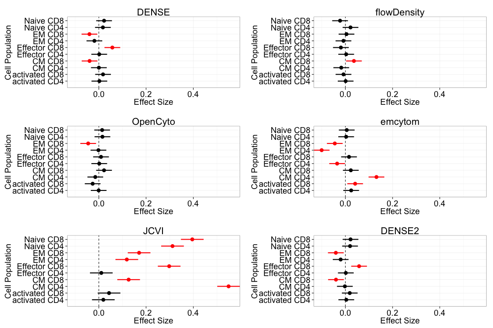
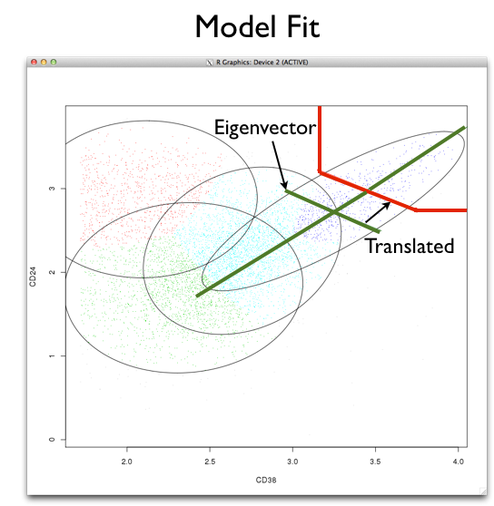

## Standardization Facilitates Reproducibility and Data Comparison
<div align="center"></div>
<div style="text-align: right; color: black; font-size: 15px;">Maecker, McCoy, Nussenblatt, Nat Rev Immunol, 2012</div>
Flow is a complex assay - *many* potential sources of variability.  
Sample collection, preparation, staining, acquisition, instrumentation, data analysis.  
Need to control as many aspects of the assay as possible.  

---

## Standardized FITMan Staining Panels Allow Comparison of Results Across Centers

<div align="center">

</div>

<div style="text-align: right; color: black; font-size: 15px;">Maecker, McCoy, Nussenblatt, Nat Rev Immunol, 2012</div>
Proposed in 2010 at FITMan meeting.  
Implemented as standardized Lyoplates (96 well plates, lyophilized reagents).

---

## Panels are Targeted at "Commonly Identified" Cell Populations.

<div style="float:left;width:60%", align="left"><div style="text-align: left; color: black; font-size: 15px;">Figure Courtesy of H. Maecker</div>
</div><div style="float:right;max-width:40%;position:relative;left:10px;top:-40px;font-size:24px;">
<h4>T-cells</h4>
<p style="text-align:left;font-size:20px;">Naive, memory, plasmablasts, transitional</p>
<h4>T regulatory cells</h4>
<p style="text-align:left;font-size:20px;">CD4, Treg, memory, naive, activated</p>
<h4>Th1 Th2 Th17 cells</h4>
<p style="text-align:left;font-size:20px;">CD4/CD8 Th1,2,17, activated</p>
<h4>B cells</h4>
<p style="text-align:left;font-size:20px;">CD4/CD8 naive, central memory, <br> effector memory, effector, activated.</p>
<h4>Dendritic cells, monocytes, NK cells</h4>
<p style="text-align:left;font-size:20px;">DC, mDC, pDC, monocytes, CD16 monocytes, conventional monocytes</p>
</div>

The panels leave room for custom markers to identify additional populations of interest.

---

## Data Analysis is a Source of Technical Variability

- Different people performing gating produce different results.
<div align="center">

</div>
- also compensation, transformation, tools and so forth.

--- &twocol

## History of the FlowCAP Workshops
### FLowCAP: Critical Assessment of Cell Population Identification Methods   
Three-year old series of workshops for benchmarking automated gating methods.  
Aiming for objective comparison of automated gating algorithms.  

***left

### **FlowCAP I and II**
Challenges focused on high dimensional automated gating (discovery).  


***right

### **FlowCAP III**
Focus on reproducibility, applicability to clinical trials.
- Lyoplate Challenge: Reproduce centralized manual gates.
- Identify methods with minimum bias and low variability.

---

## FlowCAP III: Lyoplate Standardized Gating
**Identify Gating Methods with low variability and bias relative to centralized manual gating**

<div align="center">

</div>

- FlowCAP III Lyoplate challenge focused on the T-cell and B-cell panels.
- 9 sites, 4 replicates of cryopreserved cells per site. 
- Centralized gating of data based on a consensus "best" approach amongst the 9 centers.
- Automated algorithms were compared against the centralized gating.

---

## Why Compare Against Manual Gating?

### In clinical trials, the things we want to measure are well defined *a-priori*.
- Flow assays are well defined.
- Cell populations of interest are well defined.
- No *immediate* need to apply high-dimensional gating for "discovery".
  - Such approaches are suitable for analysis of secondary endpoints.
 
### *Large* data sets.
- Gating is tedious and subject to human error (this has been shown over and over).
- We want to automate the repetitive tasks. Make them:
  - *Robust and Reproducible*

---

## Automated Gating Methods Should Perform At Least as Well as Centralized Gating


---

## FlowCAP Participants (Lyoplate Challenge)

### *DENSE* ( A. Brandes, Broad Institute )
### *flowDensity* ( J. Taghiyar, BC Cancer Agency )
### *OpenCyto* ( J. Ramey, FHCRC )
### *emcytom* ( K. Wang, University of Queensland )
### *FLOCK* ( R. Stanton, JCVI )
### *Centralized Gating* ( Current best practice )

---

## FlowCAP III Gating Evaluation Criteria

Assess *automated methods* relative to *central manual gating*.
- **Variability**
  - Coefficients of variation across centers
- **Bias:**
   $RMSD_{gpc} = \sqrt{\frac{\sum(y_{gcpr}-\mu_{mpc})}{R}}$
- **Mixed Effects Model:**
  $y_{gpcr}=\mu+\phi_{p}+\color{red}{\gamma_{g}}+\color{red}{\phi\gamma_{pg}}+(\phi\chi)_{pc}+\epsilon_{gpcr}$
  - Fixed gating and cell population effects.
  - Random center $\times$ cell population effects.
  - Interested in *interaction* and *contrasts* of fixed effects.  $(\gamma_g + \phi\gamma_pg -\gamma_0 - \phi\gamma_{p0} = 0)$  
An ideal automated gating method will have low bias and low variability for each population.

---&twocol

## Centralized Gating of the B-cell panel

### flowWorkspace: Import Manually Gated Data from flowJo
*http://www.github.com/RGLab/flowWorkspace* ([Bioconductor](http://bioconductor.org/packages/2.12/bioc/html/flowWorkspace.html))  
Reproduce FlowJo gating in *R* from an exported workspace.


***left

```custom
ws<-openWorkspace("./Data/Centralized T-cell.xml");
G<-parseWorkspace(ws);
plotGate(G[[1]]); #Plot all B-cell manual gates
```
- Extract manual gates, population statistics and compare against automated gating.

***right

<div style="width:100%;">

</div>

---

## B-cell Panel Variability
<div align="center">
  
</div>
Cross center variability of automated gating methods is comparable to centralized gating.


---


## T-cell Panel Variability
<div align="center">

</div>
At least one method per panel matches the variability of centralized gating for all populations.

---

## B-cell Panel Bias
<div align="center"></img></div>
Three methods provided unbiased cell population estimates for the B-cell panel.

---

## T-cell Panel Bias
<div align="center">
</img></div>

Three methods were mostly unbiased, having difficulty with some rare or poorly resolved cell populations.

---

## OpenCyto Framework: Construct flexible gating pipelines

### Goal: Make the best algorithms available for use.
*http://www.github.com/RGLab/openCyto*

Integrates core R flow infrastructure with automated gating algorithms   
(*Bayesian flowClust*, *flowCore*, *flowDensity*, *DENSE*)

- *Modular architecture:* plug-in any gating algorithms.
- *High-level description of gating schemes*
  - User defines *hierarchy* of cell populations and relevant markers
  - Higher-dimensional gating (e.g. >2D)  is available.  
  
**Framework abstracts away most of the R-coding.**

---

## OpenCyto: Defining cell populations

#### Example CSV Gating Template Definition (Lyoplate B-cell Panel)


Alias|population|parent|dims|method|options
-----|----------|------|----|------|--------
nonDebris|nonDebris+|root|FSC-A|flowClust|min=0
singlets|singlets+|nonDebris|FSCA,FSCH|singletGate|  
lymph|lymph|singlets|FSCA,SSCA|flowClust|K=3,quantile=0.95,target=c(1e5,5e4)
cd3|cd3-|lymph|cd3|flowClust|K=3,neg=2
cd19|cd19+|CD3|cd20|flowClust|K=2
cd20|cd20+|CD3|cd20|flowClust|K=2
cd19&!cd20|cd19&!cd20|cd3|boolGate|cd19&!cd20
cd19&cd20|cd19&cd20|cd3|boolGate|cd19&cd20
transitional|transitional|cd19&cd20|cd38,cd24|flowClust|K=5,gate_type='axis',target=c(3.5e3,3.5e3),quantile=0.995,axis_translation=0.35

#### R Code to Run the Gating

```custom2
template<-gatingTemplate("bcellTemplate.csv")
fs<-readFlowSet(file="Data/Bcells/")
gs<-GatingSet(fs)
G<-gating(template,gs)
```

---

## OpenCyto Framework: Automated Gates

Makes complex algorithms easy to use.


<div style="float: left;">


</div>

--- &twocol

## Acknowledgements

***left
### **FlowCAP**
<font color="blue">Lyoplate Data</font><br>
Holden Maecker  (Stanford)  
Phil McCoy  (NHLBI)
FOCIS and HIPC consortia
Participating Centers  
<font color="blue">FlowCAP Coordinating Committee</font><br>
Raphael Gottardo (FHCRC)  
Ryan Brinkman (BCCA)  
Richard Scheuermann (JCVI)  
Tim Mossman (U Rochester)  
Nima Aghaeepour (Stanford, BCCA)   
*Thanks to all FlowCAP*  
*Participants*  
NIH and NIAID

***right

### **R Flow Tools**
*Bioconductor Flow Package Contributors*  
<font color="blue">FHCRC</font><br>
Raphael Gottardo  
Mike Jiang  
John Ramey  
<font color="blue">BCCA</font><br>
Ryan Brinkman  
Nima Aghaeepour  
Jafar Taghiyar  
<font color="blue">TreeStar</font><Br>
Adam Triester  
Jay Almarode  

---

## Take Home Messages

### There are automated gating algorithms that are sufficiently robust to be useful for data analysis *today*.   
  - **DENSE** (Broad Institute), **flowDensity** (BCCA), **OpenCyto** (FHCRC)
  
### The tools are available to make them practical to use for your data.

<p style="float:left; font-size:20px;position:absolute;bottom:10px;color:red;">Get these slides online: <a href="http://github.com/gfinak/Talks/tree/master/LyoplateFlowCAP3">http://www.github.com/gfinak/Talks/LyoplateFlowCAP3</a><br></p>
