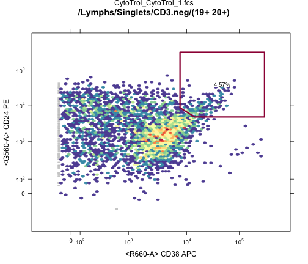

## R Tools for Flow Cytometry Data Analysis
R provides a suite of free, open-source tools for flow cyotometry *data analysis*.
- Storage, preprocessing, transformation, compensation, gating.


---

## ncdfFlow

[NetCDF](http://www.unidata.ucar.edu/software/netcdf/)-based storage of large flow cytometry data sets.

*http://www.github.com/RGLab/ncdfFlow* ([Bioconductor](http://bioconductor.org/packages/2.12/bioc/html/ncdfFlow.html))

  - Data remains on disk - accessed as if in memory - small RAM footprint.
  - Handles large studies (1000's of FCS files).
    - *e.g.* 34 FCS files from one lyoplate panel from nine sites.
  


```r
f <- list.files(path="./Data/T-cell FCS files/",pattern="fcs",recursive=TRUE,full=TRUE)
dat<-read.ncdfFlowSet(f,ncdfFile="./myncfile")
```

Data Object | Size
-----------|----------
R object   | 69.19 Kb
NetCDF Data file  | 662.74 Mb


--- &twocol

## flowWorkspace
*http://www.github.com/RGLab/flowWorkspace* ([Bioconductor](http://bioconductor.org/packages/2.12/bioc/html/flowWorkspace.html))  
Reproduce FlowJo gating in *R* from an exported workspace.

***left


```custom
ws<-openWorkspace("./Data/Centralized T-cell.xml");
G<-parseWorkspace(ws);
plotGate(G[[1]],"CD3"); #Plot CD3 gate
plot(G[[1]]);           #Plot gating hierarchy
```



***right


---

## OpenCyto
*http://www.github.com/RGLab/openCyto*

Integrates *flowWorkspace* infrastructure with automated gating tools (*Bayesian flowClust*, *flowCore*, others)
- Modular framework: plug-in your own gating algorithms
- Template-based automated gating
  - User-defined template describes a *hierarchy* of cell population hierarchy and relevant markers
  - Gating is *data-driven*. (User doesn't define any gates)
  - Higher-dimensional gating (e.g. >2D)  *is* available.

---

## OpenCyto

### Example CSV Gating Template Definition (B-cell Panel)


Alias|population|parent|dims|method|options
-----|----------|------|----|------|--------
nonDebris|nonDebris+|root|FSC-A|flowClust|min=0
singlets|singlets+|nonDebris|FSC-A,SSC-A|singletGate|
lymph|lymph|singlets |FSC-A,SSC-A|flowClust|K=3,quantile=0.95,target=c(1e5,5e4)
CD3|CD3+|lymph|CD3|flowClust|K=3,neg=2
CD4|CD4+|CD3|CD4,SSC-A|flowClust|
CD8|CD8+|CD3|CD8,SSC-A|flowClust|

### R Code to Run the Gating

```custom2
template<-gatingTemplate("bcellTemplate.csv")
fs<-readFlowSet(file="Data/Bcells/")
gs<-GatingSet(fs)
G<-gating(template,gs)
```

--- &twocol

## FlowCAP: Critical Assessment of Cell Population Identification Methods
Three-year old series of workshops for benchmarking automated gating methods vs. manual gating

***left

### **FlowCAP I and II**
Focus on high dimensional automated gating.  


***right

### **FlowCAP III**
Focus on reproducibility, applicability to clinical trials.
- Reproduce cell population statistics from standardized Lyoplate data with minimum variability and bias.
- Predict vaccination status from ICS data.

---

## Standardized Lyoplate Staining Panels

<div>

</div>

<div style="text-align: right; color: black; font-size: 18px;">Maecker, McCoy, Nussenblatt, Nat Rev Immunol, 2012</div>

---

## FlowCAP III: Lyoplate Standardized Gating
**Identify Gating Methods with low variability and bias relative to centralized manual gating**


- FlowCAP focused on the T-cell and B-cell panels.
- 9 sites, 4 replicates of cryopreserved cells per site. 
- Local, central, and automated gating.

---

## Centralized Gating Reduces Cell Population Variability


---

## Participants

### *DENSE* ( A. Brandes, Broad Institute )
### *flowDensity* ( J. Taghiyar, BC Cancer Agency )
### *OpenCyto* ( J. Ramey, FHCRC )
### *emcytom* ( K. Wang, University of Queensland )
### *FLOCK* ( R. Stanton, JCVI )
### *Centralized Gating* ( Current best practice )

---

## FlowCAP III Gating Evaluation Criteria

Assess *automated methods* relative to *central manual gating*.
- **Variability**
  - Coefficients of variation across centers
- **Bias:**
   $RMSD_{gpc} = \sqrt{\frac{\sum(y_{gcpr}-\mu_{mpc})}{R}}$
- **Mixed Effects Model:**
  $y_{gpcr}=\mu+\phi_{p}+\gamma_{g}+\color{red}{\phi\gamma_{pg}}+(\phi\chi)_{pc}+\epsilon_{gpcr}$
  - Fixed gating and cell population effects.
  - Random center $\times$ cell population effects.
  - Interested in *interaction* and *contrasts* of fixed effects.

An ideal automated gating method will have low bias and low variability for each population.

---

## Results

---

## Conclusions

---

## Acknowledgements
