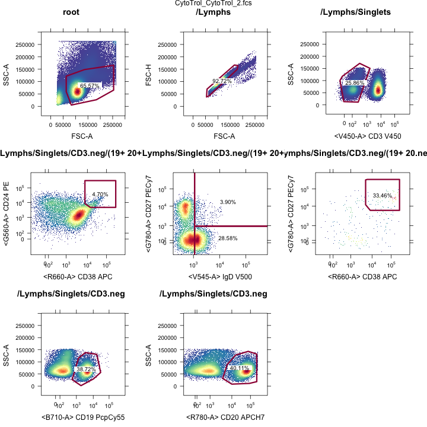
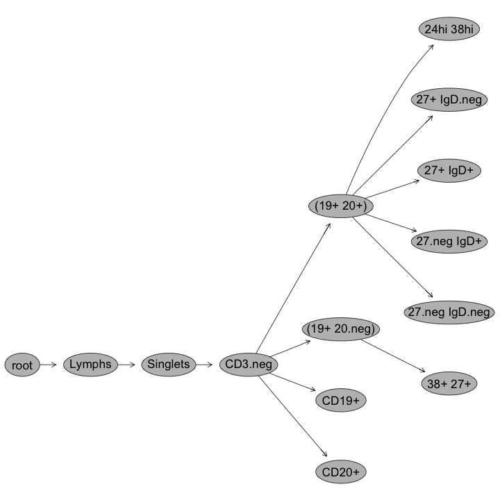
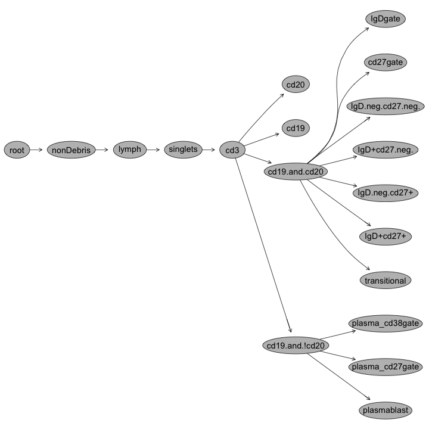
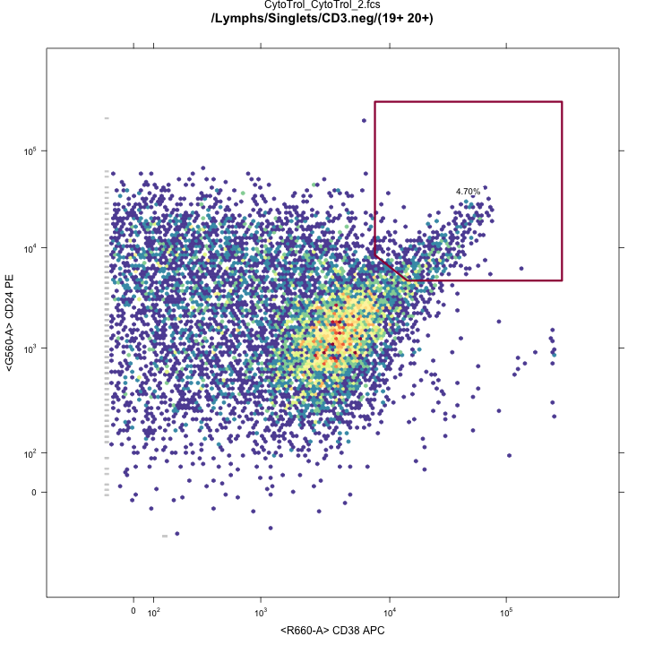

## R Tools for Flow Cytometry Data Analysis
R provides a suite of *free*, *open-source* tools for flow cyotometry data analysis.
- From storage, preprocessing, transformation, compensation, and gating, to downstream analysis.

<div style="position:relative;">
<div align="center">

</div>
<div style="position: absolute; top: -10px; left 0px; width: 100%; height:99%; auto; border: 1px solid black; background-color: gray; opacity:0.4;">
</div>

<div style="float:left; position: absolute; top: 10px; right:0px; width: 33%; height: 100%; color: blue; font-style: italic; opacity: 1;">
<b style="color:black">Gating and Clustering</b><br><br>
<font color="red">OpenCyto<br></font>
flowClust<br>
flowMerge<br>
flowMeans<br>
SamSpectral<br>
FLAME<br>
flowPhyto<br>
flowFP<br>
flowPeaks<br>
flowKoh<br>
NMF-curvHDR<br>
SPADE<br>
PRAMS<br>
</div>
<div style="float:left; position: absolute; top: 10px; left:10px; width: 33%; height: 100%; color: blue; font-style: italic; opacity: 1;">
<b style="color:black">Discovery and Downstream Analysis</b><br><br>
flowType<br>
RchyOptimyx<br>
MIMOSA<br>
</div>

<div style="float:left; position: absolute; top: 10px; left:350px; width: 33%; height: 100%; color: blue; font-style: italic; opacity: 1;">
<b style="color:black">Infrastructure, Preprocessing and Visualization</b><br><br>
<font color="red">flowWorkspace<br></font>
<font color="red">ncdfFlow<br></font>
flowCore<br>
flowUtils<br>
flowTrans<br>
flowStats<br>
plateCore<br>
flowViz<br>
flowQ<br>
QUALIFIER  
</div>
</div>

---

## ncdfFlow: large data sets, little memory

[NetCDF](http://www.unidata.ucar.edu/software/netcdf/)-based storage of large flow cytometry data sets.

*http://www.github.com/RGLab/ncdfFlow* ([Bioconductor](http://bioconductor.org/packages/2.12/bioc/html/ncdfFlow.html))

  - Data remains on disk (e.g. network drive) - accessed as if in memory - small RAM footprint.
  - Handles large studies (1000's of FCS files).
    - *e.g.* 34 FCS files from one lyoplate panel from nine sites.
  


```r
f <- list.files(path="./Data/T-cell FCS files/",pattern="fcs",recursive=TRUE,full=TRUE)
dat<-read.ncdfFlowSet(f,ncdfFile="./myncfile")
```

Data Object | Size
-----------|----------
R object   | 69.19 Kb
NetCDF Data file  | 662.74 Mb


--- &twocol

## flowWorkspace: Import your flowJo data
*http://www.github.com/RGLab/flowWorkspace* ([Bioconductor](http://bioconductor.org/packages/2.12/bioc/html/flowWorkspace.html))  
Reproduce FlowJo gating in *R* from an exported workspace.

***left


```custom
ws<-openWorkspace("./Data/Centralized T-cell.xml");
G<-parseWorkspace(ws);
plotGate(G[[1]],"24hi 38hi"); #Plot transitional gate
plot(G[[1]]);           #Plot gating hierarchy
```


***right


---

## OpenCyto: A flexible framework for automated gating
*http://www.github.com/RGLab/openCyto*

Integrates *flowWorkspace* infrastructure with automated gating tools (*Bayesian flowClust*, *flowCore*, and others)
- *Modular framework:* plug-in your own gating algorithms
- *High-level automated gating*
  - User defines *hierarchy* of cell populations and relevant markers
  - Gating is *data-driven*. (User doesn't define *gates* just *cell populations*)
  - Higher-dimensional gating (e.g. >2D)  is available.  
Framework abstracts away most of the R-coding.

---

## OpenCyto: Defining cell populations

#### Example CSV Gating Template Definition (Lyoplate B-cell Panel)


Alias|population|parent|dims|method|options
-----|----------|------|----|------|--------
nonDebris|nonDebris+|root|FSC-A|flowClust|min=0
singlets|singlets+|nonDebris|FSCA,FSCH|singletGate|  
lymph|lymph|singlets|FSCA,SSCA|flowClust|K=3,quantile=0.95,target=c(1e5,5e4)
cd3|cd3-|lymph|cd3|flowClust|K=3,neg=2
cd19|cd19+|CD3|cd20|flowClust|K=2
cd20|cd20+|CD3|cd20|flowClust|K=2
cd19&!cd20|cd19&!cd20|cd3|boolGate|cd19&!cd20
cd19&cd20|cd19&cd20|cd3|boolGate|cd19&cd20
transitional|transitional|cd19&cd20|cd38,cd24|flowClust|K=5,gate_type='axis',target=c(3.5e3,3.5e3),quantile=0.995,axis_translation=0.35

#### R Code to Run the Gating

```custom2
template<-gatingTemplate("bcellTemplate.csv")
fs<-readFlowSet(file="Data/Bcells/")
gs<-GatingSet(fs)
G<-gating(template,gs)
```

---

## OpenCyto: View all gates


<div style="float: left;">


</div>
<div style="float:left; color: red;">&nbsp&nbsp&nbsp&nbsp&nbsp&nbsp&nbsp&nbsp&nbsp&nbspManual Gating</div><div style="float:right; color: red;">Automated Gating&nbsp&nbsp&nbsp&nbsp&nbsp&nbsp&nbsp&nbsp&nbsp&nbsp</div>

---

## Gating Hierarchies

<div>


</div>
<div style="float:left; color:red;">&nbsp&nbsp&nbsp&nbsp&nbsp&nbsp&nbsp&nbsp&nbsp&nbspManual Gating</div><div style="float:right; color:red;">Automated Gating&nbsp&nbsp&nbsp&nbsp&nbsp&nbsp&nbsp&nbsp&nbsp&nbsp</div>

---

## Transitional B-cell gates
<div>


</div>
<div style="float:left; color:red;">&nbsp&nbsp&nbsp&nbsp&nbsp&nbsp&nbsp&nbsp&nbsp&nbspManual Gating</div><div style="float:right;color:red;">Automated Gating&nbsp&nbsp&nbsp&nbsp&nbsp&nbsp&nbsp&nbsp&nbsp&nbsp</div>


--- &twocol

## FlowCAP: Critical Assessment of Cell Population Identification Methods
Three-year old series of workshops for benchmarking automated gating methods vs. manual gating

***left

### **FlowCAP I and II**
Focus on high dimensional automated gating.  


***right

### **FlowCAP III**
Focus on reproducibility, applicability to clinical trials.
- Reproduce cell population statistics from standardized Lyoplate data with minimum variability and bias.
- Predict vaccination status from ICS data.

---

## Standardized Lyoplate Staining Panels

<div>

</div>

<div style="text-align: right; color: black; font-size: 18px;">Maecker, McCoy, Nussenblatt, Nat Rev Immunol, 2012</div>

---

## FlowCAP III: Lyoplate Standardized Gating
**Identify Gating Methods with low variability and bias relative to centralized manual gating**


- FlowCAP focused on the T-cell and B-cell panels.
- 9 sites, 4 replicates of cryopreserved cells per site. 

---

## Why Compare Against Manual Gating?

### In clinical trials, the things we want to measure are well defined *a-priori*.
- Flow assays are well defined.
- Cell populations of interest are well defined.
- No immediate need to go fishing with high-dimensional gating for "discovery".
 
### Generally large data sets.
- Gating is tedious and subject to human error (this has been shown).
- Automate the repetitive tasks. 
  - *Robust*
  - *Reproducible*

---

## Centralized Gating Reduces Cell Population Variability


---

## FlowCAP Participants (Lyoplate Challenge)

### *DENSE* ( A. Brandes, Broad Institute )
### *flowDensity* ( J. Taghiyar, BC Cancer Agency )
### *OpenCyto* ( J. Ramey, FHCRC )
### *emcytom* ( K. Wang, University of Queensland )
### *FLOCK* ( R. Stanton, JCVI )
### *Centralized Gating* ( Current best practice )

---

## FlowCAP III Gating Evaluation Criteria

Assess *automated methods* relative to *central manual gating*.
- **Variability**
  - Coefficients of variation across centers
- **Bias:**
   $RMSD_{gpc} = \sqrt{\frac{\sum(y_{gcpr}-\mu_{mpc})}{R}}$
- **Mixed Effects Model:**
  $y_{gpcr}=\mu+\phi_{p}+\color{red}{\gamma_{g}}+\color{red}{\phi\gamma_{pg}}+(\phi\chi)_{pc}+\epsilon_{gpcr}$
  - Fixed gating and cell population effects.
  - Random center $\times$ cell population effects.
  - Interested in *interaction* and *contrasts* of fixed effects.  ($\gamma_g + \phi\gamma_{pg} -\gamma_0 - \phi\gamma_{p0} = 0$)  
An ideal automated gating method will have low bias and low variability for each population.

---


## T-cell Panel Results

  
Cross center variability of automated gating methods is comparable to centralized gating.

---

## B-cell Panel Results

  
At least one method per panel matches the variability of centralized gating for all populations.

---

## Bias: T-cell panel
</img>

---

## Bias: B-cell panel
</img>


--- &twocol

## Acknowledgements

***left

### **R Flow Tools**
*Bioconductor Flow Package Contributors*  
<font color="blue">FHCRC</font><br>
Raphael Gottardo  
Mike Jiang  
John Ramey  
<font color="blue">BCCA</font><br>
Ryan Brinkman  
Nima Aghaeepour  
Jafar Taghiyar
<font color="blue">TreeStar</font><Br>
Adam Triester  
Jay Almarode  

***right

### **FlowCAP**
<font color="blue">Lyoplate Data</font><br>
Holden Maecker  (Stanford)  
Phil McCoy  (NHLBI)
FOCIS and HIPC consortia
Participating Centers  
<font color="blue">FlowCAP Coordinating Committee</font><br>
Raphael Gottardo (FHCRC)  
Ryan Brinkman (BCCA)  
Richard Scheuermann (JCVI)  
Tim Mossman (U Rochester)  
Nima Aghaeepour (Stanford, BCCA)   
*Thanks to all FlowCAP*  
*Participants*  
NIH and NIAID

---

## Take Home Message

#### There are automated gating algorithms that are sufficiently robust to be useful for data analysis *today*.   
  - **DENSE** (Broad Institute), **flowDensity** (BCCA), **OpenCyto Framework** (FHCRC)
  
#### A wealth of **FREE** open-source flow tools are available for R.
- OpenCyto framework emphasizing ease of use.
- Handling real-world data sets (*large studies*)
- Access manually gated FlowJo data in R.
    - (support for Mac, Windows, version X and older)
    
### There is now little reason not to start exploring your flow data in R.  

<p style="float:left; font-size:20px;position:absolute;bottom:10px;color:red;">Get these slides online: <a href="http://github.com/gfinak/Talks/tree/master/RFlowToolsFlowCAP">http://www.github.com/gfinak/Talks/RFlowToolsFlowCAP</a><br></p>
